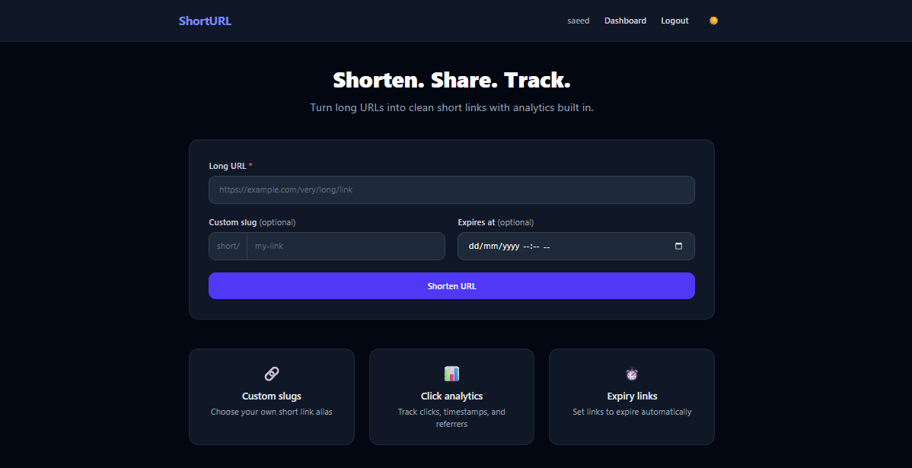

# URL Shortener with Analytics & Load Balancing

<div align="center">


**CE408 Cloud Computing Project**  
Muhammad Saeed Shaikh (2022421) · Affan Khan (2022047)

</div>

---

## Overview

Full-stack URL shortener deployed on GCP with horizontal scaling and HTTP load balancing.

**Features:**
- Shorten URLs — auto-generated or custom slugs
- Expiry dates per link
- Click analytics — count, timestamps, IP, referrer
- QR code per link with download
- 4-second interstitial on redirect
- Dark mode with system preference detection

**Cloud Architecture:**
- **2 VMs** (e2-micro) in Managed Instance Group — autoscales to 5 under load
- **GCP HTTP Load Balancer** — distributes traffic with health checks
- **Cloud SQL** PostgreSQL 15 (db-f1-micro) — managed DB over TCP
- **Artifact Registry** — private Docker image registry
- **Rolling deploys** — zero downtime, VMs replaced one at a time



---

## Table of Contents

1. [Tech Stack](#tech-stack)
2. [Prerequisites](#prerequisites)
3. [Local Development](#local-development)
4. [Deploying to GCP](#deploying-to-gcp)
5. [Pushing Updates](#pushing-updates)
6. [Teardown](#teardown)
7. [Project Structure](#project-structure)
8. [API Endpoints](#api-endpoints)

---

## Tech Stack

| Layer | Technology |
|-------|-----------|
| Backend | Python 3.12 / Flask |
| Database | PostgreSQL (Cloud SQL) / SQLite (local dev) |
| Frontend | Jinja2 + Tailwind CSS v4 |
| Container | Docker (multi-stage build) |
| Cloud | GCP — Compute Engine, Cloud SQL, Load Balancer, Artifact Registry |

---

## Prerequisites

Install all tools via winget (Windows):

```powershell
winget install Python.Python.3.12
winget install OpenJS.NodeJS.LTS
winget install Docker.DockerDesktop
winget install Google.CloudSDK
```

After installing:
- Launch **Docker Desktop** and wait for engine to start
- Restart terminal, then run `gcloud init` to authenticate

---

## Local Development

**1. Clone and create virtual environment**
```powershell
git clone https://github.com/MSaeedShaikh/CC_Project.git
cd CC_Project

python -m venv venv
venv\Scripts\activate
```

**2. Install dependencies**
```powershell
pip install -r requirements.txt
npm install
```

**3. Configure environment**
```powershell
cp .env.example .env
# Edit .env — for local dev, leave GCP_* and DATABASE_URL blank
# Falls back to SQLite automatically
```

**How `DATABASE_URL` is resolved:**
| Condition | Result |
|-----------|--------|
| `DATABASE_URL` set explicitly | Uses it as-is |
| `GCP_PROJECT_ID` set | Constructs Cloud SQL socket URL |
| Neither | Falls back to `sqlite:///urlshortener.db` |

**4. Build CSS and run**
```powershell
npm run build:css
python run.py
```

App at **http://localhost:5000**

**Development commands**

| Task | Command |
|------|---------|
| Run dev server | `python run.py` |
| Auto-rebuild CSS | `npm run watch:css` (separate terminal) |
| One-shot CSS build | `npm run build:css` |
| DB migration | `flask db migrate -m "msg"` then `flask db upgrade` |

**Reset local database**
```powershell
del instance\urlshortener.db
python run.py
```

---

## Deploying to GCP

> Requires a GCP project with billing enabled.

**1. Authenticate**
```powershell
gcloud auth login
gcloud auth configure-docker us-central1-docker.pkg.dev
gcloud config set project YOUR_PROJECT_ID
```

**2. Create `.env`**
```powershell
cp .env.example .env
# Set: SECRET_KEY, DB_PASS, GCP_PROJECT_ID, GCP_REGION, GCP_ZONE
# Leave DATABASE_URL blank for now — filled in after step 3
```

**3. Create Cloud SQL**
```powershell
.\gcp\cloud-sql-setup.ps1
```
Script creates the PostgreSQL instance with public IP access enabled, then prints a `DATABASE_URL` — copy it into `.env` as `DATABASE_URL=postgresql://...`

**4. Enable required APIs + create Artifact Registry**
```powershell
gcloud services enable compute.googleapis.com sqladmin.googleapis.com artifactregistry.googleapis.com

gcloud artifacts repositories create url-shortener --repository-format=docker --location=us-central1 --project=YOUR_PROJECT_ID
```

**5. Build and push Docker image**
```powershell
.\gcp\push-image.ps1
```

**6. Deploy VMs and load balancer**
```powershell
.\gcp\instance-template.ps1
.\gcp\load-balancer.ps1
```

**7. Get external IP**
```powershell
gcloud compute forwarding-rules describe url-shortener-rule --global --format='get(IPAddress)'
```

**8. Set `BASE_URL` and redeploy**
```powershell
# Edit .env — set BASE_URL=http://<IP from step 7>
.\gcp\push-image.ps1
gcloud compute instance-groups managed rolling-action replace url-shortener-mig --zone=us-central1-a
```

App is live at `http://<IP>`. Load balancer takes ~5 min to become healthy on first creation.

---

## Pushing Updates

After any code change:

**1. Rebuild and push image**
```powershell
.\gcp\push-image.ps1
```

**2. Rolling replace — zero downtime**
```powershell
gcloud compute instance-groups managed rolling-action replace url-shortener-mig --zone=us-central1-a
```

**3. Watch rollout**
```powershell
gcloud compute instance-groups managed list-instances url-shortener-mig --zone=us-central1-a
```

**Notes:**
- Dependency changes — `requirements.txt` picked up automatically on rebuild
- Model changes — run `flask db upgrade` against Cloud SQL after deploy

---

## Teardown

> **Warning:** Permanently deletes all VMs, the database, and stored data. Cannot be undone.

```powershell
.\gcp\teardown.ps1
```

To **stop billing without deleting** — resize MIG to 0:
```powershell
gcloud compute instance-groups managed resize url-shortener-mig --size=0 --zone=us-central1-a
```
Cloud SQL still bills when stopped. Delete it if not needed.

---

## Project Structure

```
├── app/
│   ├── __init__.py       # app factory, blueprints, db init
│   ├── models.py         # User, URL, Click SQLAlchemy models
│   ├── auth.py           # register / login / logout
│   ├── urls.py           # shorten, redirect, delete routes
│   ├── analytics.py      # dashboard + /api/stats/<code>
│   ├── qr.py             # QR code generation
│   ├── templates/        # Jinja2 HTML templates
│   └── static/
│       ├── input.css     # Tailwind source
│       └── output.css    # compiled (gitignored)
├── config.py             # env config, DATABASE_URL resolution
├── run.py                # dev entry point
├── Dockerfile            # multi-stage: Node (CSS) → Python
├── requirements.txt
├── package.json          # Tailwind CLI scripts
├── .env.example          # copy to .env and fill in values
└── gcp/
    ├── cloud-sql-setup.ps1
    ├── instance-template.ps1
    ├── load-balancer.ps1
    ├── push-image.ps1
    └── teardown.ps1
```

---

## API Endpoints

| Method | Route | Auth | Description |
|--------|-------|------|-------------|
| GET | `/` | — | Home / shorten form |
| POST | `/shorten` | ✓ | Create short URL |
| GET | `/<code>` | — | Redirect (4s interstitial) |
| GET | `/qr/<code>` | — | QR code PNG |
| GET | `/dashboard` | ✓ | User's links |
| GET | `/api/stats/<code>` | ✓ | Click analytics JSON |
| DELETE | `/api/urls/<id>` | ✓ | Soft-delete link |
| GET | `/health` | — | Load balancer health check |
